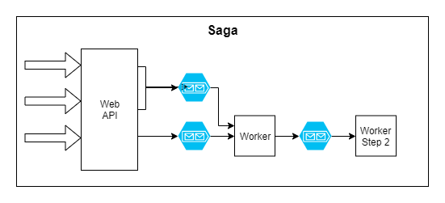

# resilient-integration

Ironclad integration architecture, developer and ops friendly. Uses [MassTransit](masstransit-project.com) for integrations.

This project is an example architecture for system integrations. It uses Web API and message queueing to create a system completely resilient to any failures. Message handlers can be easily moved across workers, workers can be scaled up and/or out, and no attempts to run integration processing will ever be lost.

Architecture:

# Sagas

Sagas can be used to support multi step processes with resiliency and recoverability between each step.

# Assumption

<em>"If anything can go wrong, it will." - Murphy's Law</em>

No system (even our own code) is immune to unforeseen errors. By moving failure points to the other side of a message bug and using an error queue, we are able to retry jobs, redeploy fixes before rerunning, or pull jobs down to lower environments for easy developer testing. We're also able to scale workers easily to adjust to workload.

# Run instructions

- Install prerequisites Node.js, docker, docker-machine, powershell
- From command line, run `docker-compose up`
- Debug ResilientIntegration.Api (Web), and ResilientIntegration.Worker* (Workers)

# Monitoring

- RabbitMQ: http://localhost:15672/#/channels (guest/guest)
- SEQ: http://localhost:5342/#/events 