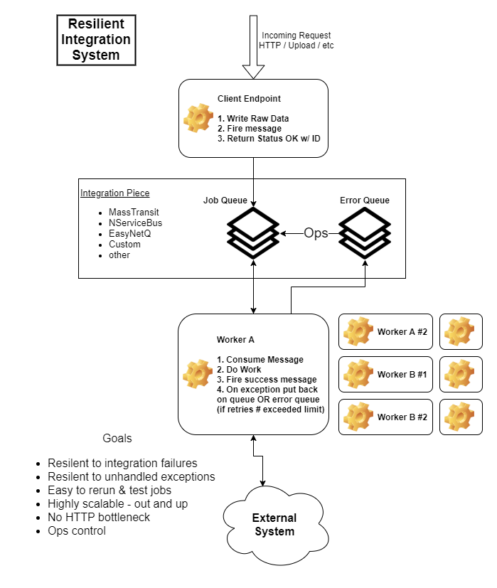

# resilient-integration

Ironclad integration architecture, developer and ops friendly.

This project is an example architecture for system integrations. It uses Web API and message queueing to create a system completely resilient to any failures. Message handlers can be easily moved across workers, workers can be scaled up and/or out, and no attempts to run integration processing will ever be lost.

Architecture:

# Assumption

<em>Wherever a failure can occur, it will, eventually.</em>

No system (even our own code) is immune to unforeseen errors. By moving failure points to the other side of a message bug and using an error queue, we are able to retry jobs, redeploy fixes before rerunning, or pull jobs down to lower environments for easy developer testing. We're also able to scale workers easily to adjust to workload.

# Run instructions

- Install prerequisites Node.js, docker, docker-machine, powershell
- execute RebuildAllDockerImages.sh or .ps1
- execute .\kubernetes\start-all.sh or .ps1
- Run the API and workers locally, or in docker

# Monitoring

- RabbitMQ: http://localhost:15672/#/channels
- SEQ: http://localhost:5341/#/events